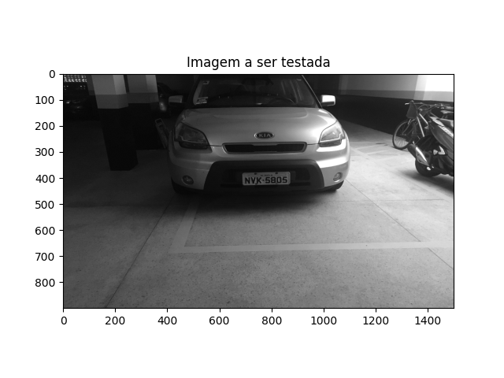
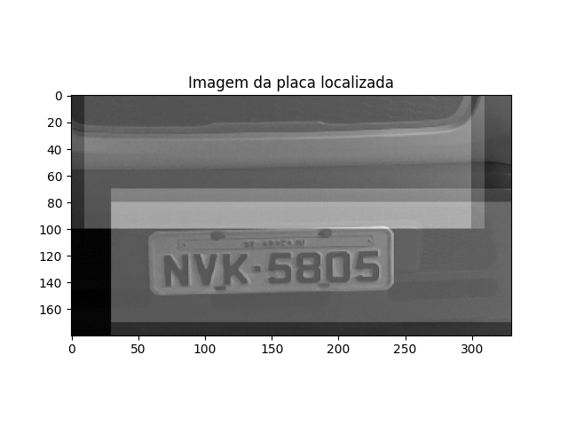
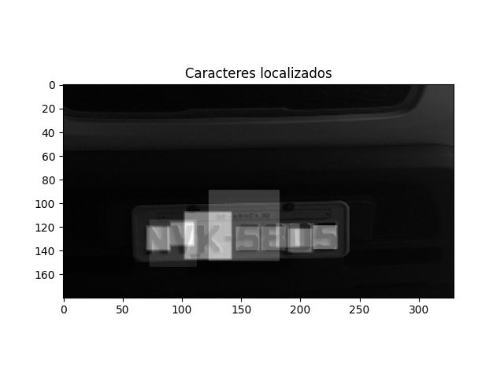
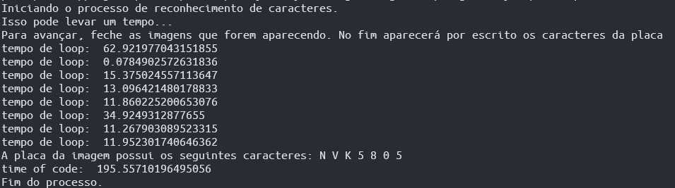

# Principal Componety Analysis Image Reconition
The idea behind this project was to show that it's possible to make a software capable to recognize characters in a car's plate using Principal Component Analysis (PCA). The thought of using PCA to make image identification was first proposed by the Professor of Digital Processing Analysis of the University of Sergipe Electrical Engineer Department, in class, mainly to identify numbers in a set of images. Then I considered that the same principle could also be used to make more complex image recognition.

The created program first identifies where the car's plate is located, then it cuts the section where it is, and then tries to find all the plate's characters by making the bigger image of the plate into small ones where the image of the characters could be easily determined.  

#

## Run Time Steps
To run the software, to to folder /source and type:
```bash
python3 main.py
```
The following pictures show how the software must behave.

- The objective of the software is to find the caracters in the car's plate of the picture bellow; 



- The program finds where the plate is more or less located;


- Then it cuts the region where the plate is;



- Then it looks for the caracters in the picture;



- The result then is shown in the terminal.




### Notice

Because I didn't find enough images of characters in plates, I couldn't build a proper database. Therefore, I had to create one of my own. And because of practical reasons, I didn't take pictures of all existing characters. The only ones I did find were: 0,5, 6, 8, K, N and V. The same ones that are in the test picture.  